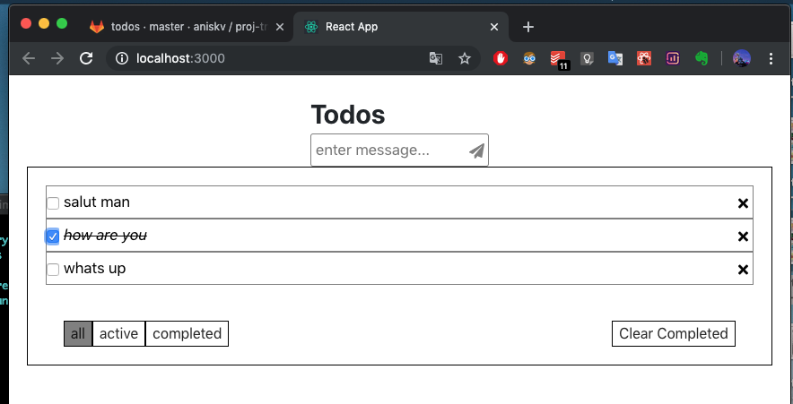

little repository to compare apollo local state vs redux.

[live DEMO](https://anisg.github.io/todoapp/)



interesting files to checkout:

Apollo Local State:

- [`pages/Root.tsx`](todoapp-with-apollo/src/pages/Root.tsx)
- [`resolvers.ts`](todoapp-with-apollo/src/resolvers.ts)
- [`index.tsx`](todoapp-with-apollo/src/index.tsx) 

Redux:

- [`pages/Root.tsx`](todoapp-with-redux/src/pages/Root.tsx)
- [`redux/reducer.ts`](todoapp-with-redux/src/redux/reducer.ts)
- [`redux/actions.ts`](todoapp-with-redux/src/redux/actions.ts)
- [`redux/state.ts`](todoapp-with-redux/src/redux/state.ts)
- [`index.tsx`](todoapp-with-apollo/src/index.tsx)


## run the apps

### todoapp-with-apollo

```
$> cd ./todoapp-with-apollo
$> yarn install
$> yarn start
```

if you want to edit the graphql operations in [`pages/Root.tsx`](todoapp-with-redux/src/pages/Root.tsx):

```
$> yarn global add apollo
$> apollo plugins:link ./scripts/generate-local-graphql
$> apollo generate-local-graphql
```

generate-local-graphql is a homemade plugin which generates graphql types and operations for typescript.


### todoapp-with-redux

```
$> cd ./todoapp-with-redux
$> yarn install
$> yarn start
```

